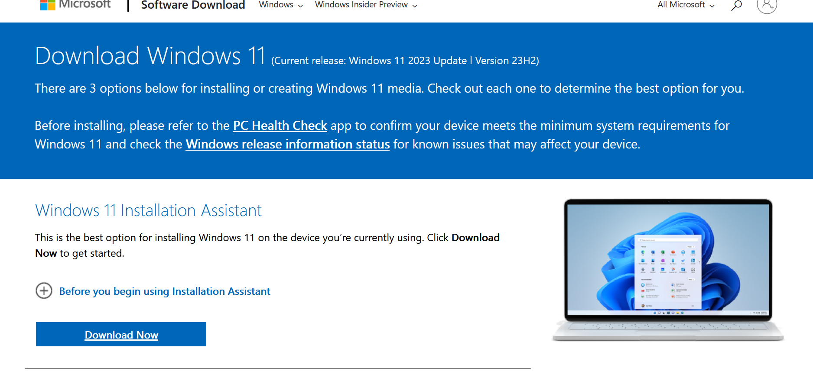
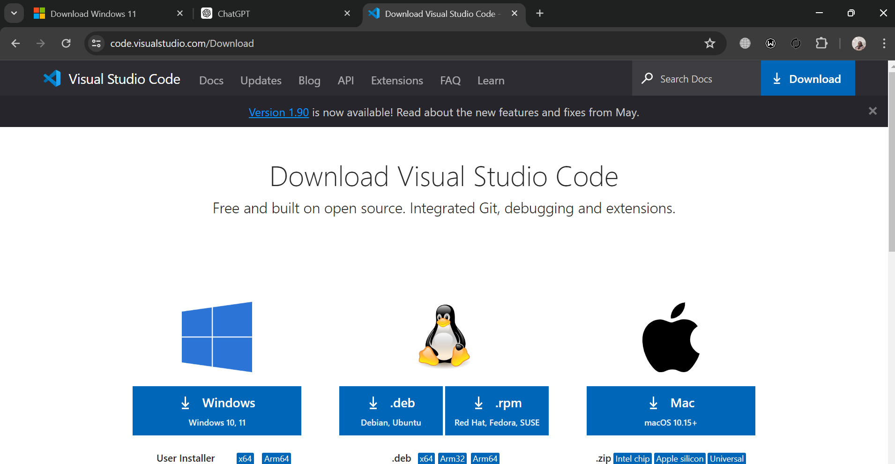
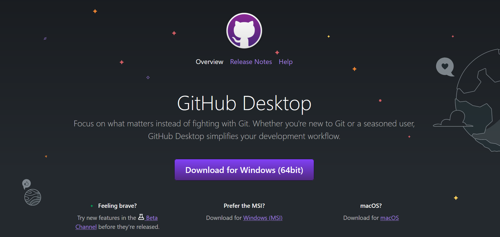
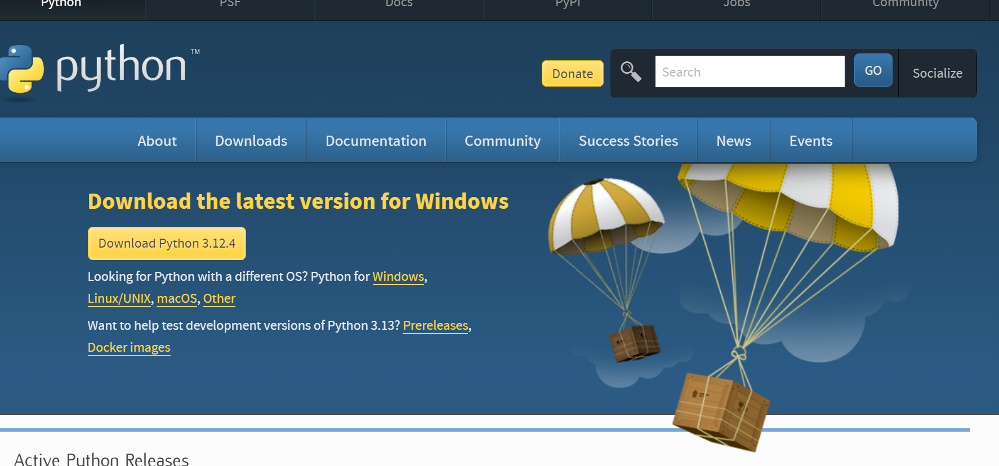
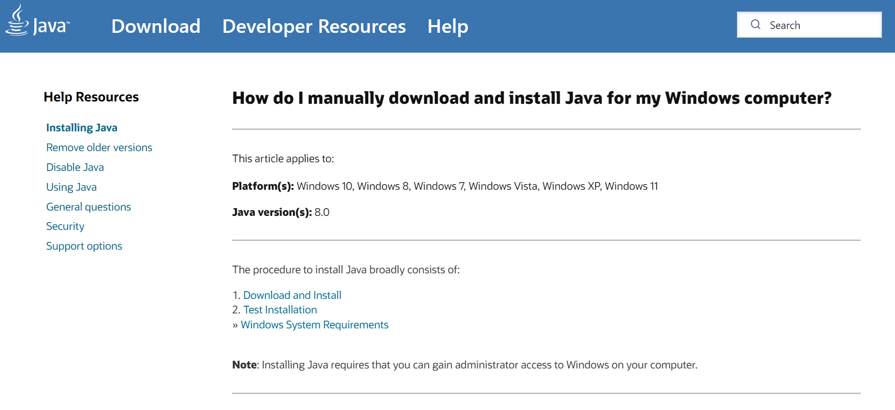
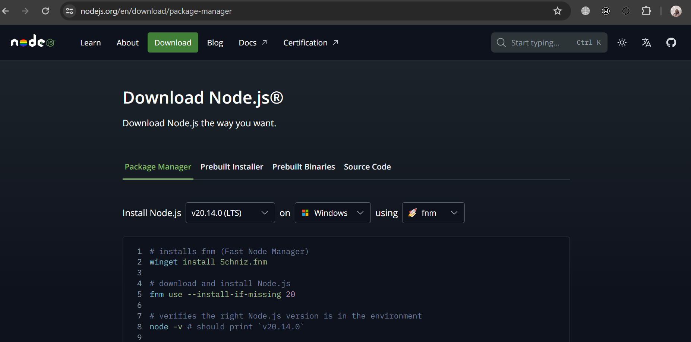
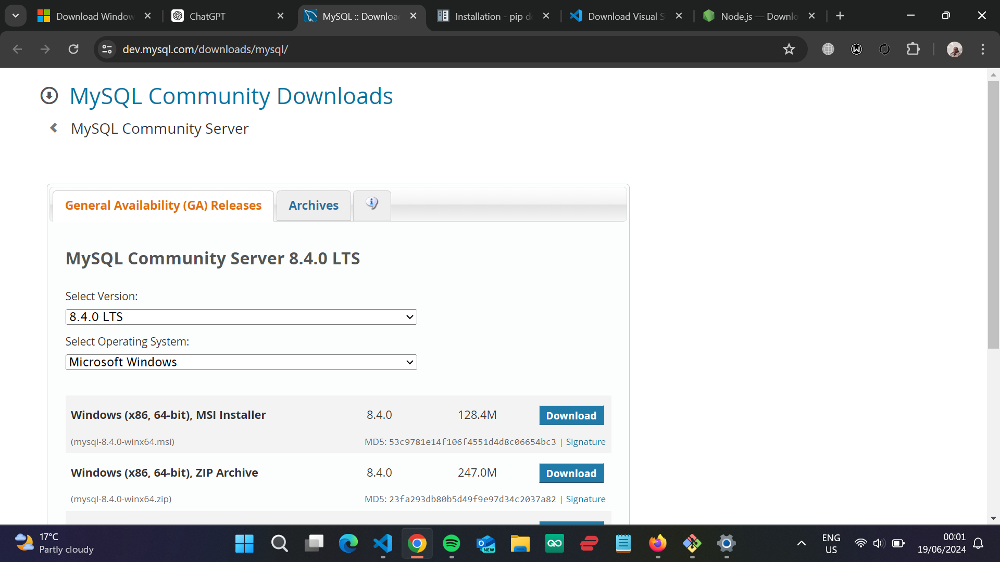
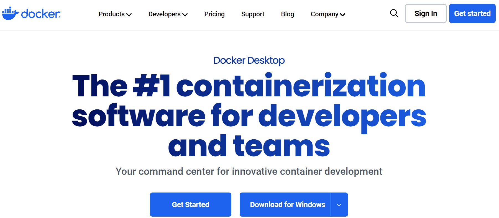

[](https://classroom.github.com/a/vbnbTt5m)
[](https://classroom.github.com/online_ide?assignment_repo_id=15284460&assignment_repo_type=AssignmentRepo)
# Dev_Setup
Setup Development Environment

#Assignment: Setting Up Your Developer Environment

#Objective:
This assignment aims to familiarize you with the tools and configurations necessary to set up an efficient developer environment for software engineering projects. Completing this assignment will give you the skills required to set up a robust and productive workspace conducive to coding, debugging, version control, and collaboration.

#Tasks:

1. Select Your Operating System (OS):
   Choose an operating system that best suits your preferences and project requirements. Download and Install Windows 11. https://www.microsoft.com/software-download/windows11
   Here's a step-by-step guide to installing Windows 11 on your PC, along with some screenshots to help you through the process:
Step 1: Download Windows 11 Installation Media

    Visit the Microsoft Windows 11 Download Page:
    Go to Microsoft's Windows 11 download page.
    Microsoft Windows 11 Download Page

    Download the Installation Assistant:
    Click on "Download Now" under the "Windows 11 Installation Assistant" section.
    Download Windows 11 Installation Assistant

Step 2: Create Installation Media

    Run the Installation Assistant:
    Open the downloaded file and follow the prompts to download the Windows 11 installation files.

    Create a Bootable USB Drive:
        Download the Windows 11 Media Creation Tool from the same download page.
        Run the tool and select "Create installation media (USB flash drive, DVD, or ISO file) for another PC."
        Follow the prompts to create a bootable USB drive.

Step 3: Install Windows 11

    Boot from USB Drive:
        Insert the bootable USB drive into your PC.
        Restart your PC and press the key (usually F2, F12, Delete, or Esc) to enter the BIOS/UEFI settings.
        Change the boot order to boot from the USB drive.

    Start Windows 11 Installation:
        Your PC will boot from the USB drive and the Windows 11 installation process will start.
        Select your language, time, and keyboard preferences, then click "Next."
        Click "Install now."

    Enter Product Key:
        Enter your Windows 11 product key if prompted, or click "I don't have a product key" if you are reinstalling Windows or will enter the key later.

    Accept License Terms:
        Read and accept the license terms, then click "Next."

    Choose Installation Type:
        Select "Custom: Install Windows only (advanced)" for a clean installation.

    Partition the Hard Drive:
        Choose the partition where you want to install Windows 11. If you are doing a clean installation, you may need to delete existing partitions.
        Select the unallocated space and click "Next."

    Install Windows 11:
        The installation process will begin. Your PC will restart several times during the installation.

Step 4: Set Up Windows 11

    Initial Setup:
        After installation, you will be guided through the initial setup process, including setting your region, keyboard layout, and connecting to a network.

    Sign In or Create Microsoft Account:
        You can sign in with your Microsoft account or create a new one.

    Customize Settings:
        Follow the prompts to customize your privacy settings, choose default apps, and other preferences.

    Complete Setup:
        Once the setup is complete, you will be taken to the Windows 11 desktop.
        

- Install a Text Editor or Integrated Development Environment (IDE):
   Select and install a text editor or IDE suitable for your programming languages and workflow. Download and Install Visual Studio Code. https://code.visualstudio.com/Download
   Download Visual Studio Installer
Visit the Visual Studio Downloads page.
Choose the version of Visual Studio you need (e.g., Community, Professional, or Enterprise).
Click the download button to get the Visual Studio Installer.
- Run Visual Studio Installer
Locate the downloaded vs_installer.exe file and run it.
The installer will download and install necessary components. This may take a few minutes.
- Select Workloads
After the installer launches, you'll see a list of available workloads (e.g., .NET desktop development, ASP.NET and web development, Node.js development).
Select the workloads relevant to your needs. You can select multiple workloads if necessary.
For example, to develop .NET applications, select the ".NET desktop development" workload.
- Individual Components (Optional)
Click on the “Individual components” tab if you need more granular control over the installation.
Here, you can select specific SDKs, libraries, and tools that are not part of any workload.
- Language Packs (Optional)
If you prefer Visual Studio in a different language, go to the “Language packs” tab.
Select the languages you need.
- Installation Locations
By default, Visual Studio will be installed in C:\Program Files (x86)\Microsoft Visual Studio.
If you need to change the installation path, click on the “Installation locations” tab and specify the paths.
- Install
Once you’ve made your selections, click the “Install” button.
The installer will begin downloading and installing the components. This may take some time depending on your selections and internet speed.
- Sign In or Start Visual Studio
After the installation completes, you will be prompted to sign in with your Microsoft account.
Signing in is optional but recommended to sync your settings and preferences across devices.
Click on “Start Visual Studio” to launch the IDE.
- Initial Configuration
On the first launch, Visual Studio will ask you to select your development settings (e.g., General, C#, Web Development).
Choose your preferred settings and color theme (e.g., Blue, Dark, Light).
Click “Start Visual Studio” to apply these settings.
- Create or Open a Project
To start a new project, click on “Create a new project” on the start page.
Select the type of project you want to create, configure the project settings, and click “Create.”
To open an existing project, click on “Open a project or solution” and navigate to your project file.
- Install Extensions (Optional)
Visual Studio supports a wide range of extensions to enhance your development experience.
Go to “Extensions” > “Manage Extensions” from the menu bar.
Browse and install extensions from the Visual Studio Marketplace.
 Update Visual Studio
- It is recommended to keep Visual Studio updated with the latest features and security patches.
Go to “Help” > “Check for Updates” regularly to ensure you have the latest updates installed.


3. Set Up Version Control System:
   Install Git and configure it on your local machine. Create a GitHub account for hosting your repositories. Initialize a Git repository for your project and make your first commit. https://github.com
   Process of Installing and Configuring Git on Windows
- Download Git
Visit the Git for Windows website.
Click the "Download" button to download the latest version of Git.
- Run the Installer
Locate the downloaded Git-<version>-<bitness>.exe file and double-click to run it.
If prompted by User Account Control, click "Yes" to allow the installer to make changes to your device.
- Setup Wizard
The Git Setup wizard will appear. Click "Next" to proceed.
- Select Destination Location
Choose the installation location. The default path is usually C:\Program Files\Git.
Click "Next" to continue.
- Select Components
Choose the components you want to install. The default selection is usually sufficient.
Options include:
Git Bash (a terminal emulator for Git commands)
Git GUI (a graphical user interface for Git)
Additional icons
Windows Explorer integration
Click "Next" to continue.
- Select Start Menu Folder
Choose the Start Menu folder name or accept the default.
Click "Next" to continue.
- Choosing the Default Editor
Select the default editor used by Git. Common choices are Vim (default), Notepad++, Visual Studio Code, Atom, etc.
Click "Next" to continue.
- Adjusting the Name of the Initial Branch
Decide if you want to use the default branch name (master) or a different name (main).
Click "Next" to continue.
- Adjusting Your PATH Environment
Choose a PATH environment:
Use Git from Git Bash only.
Use Git from the command line and also from 3rd-party software (recommended).
Use Git and optional Unix tools from the Windows Command Prompt.
Click "Next" to continue.
- Choosing HTTPS Transport Backend
Choose the HTTPS transport backend:
Use the OpenSSL library (default).
Use the native Windows Secure Channel library.
Click "Next" to continue.
- Configuring the Line Ending Conversions
Choose how Git should handle line endings:
Checkout Windows-style, commit Unix-style line endings (recommended).
Checkout as-is, commit Unix-style line endings.
Checkout as-is, commit as-is.
Click "Next" to continue.
- Configuring the Terminal Emulator
Choose the default terminal emulator for Git Bash:
Use MinTTY (default).
Use the Windows' default console window.
Click "Next" to continue.
- Choosing the Default Behavior of git pull
Choose the default behavior for git pull:
Default (fast-forward or merge).
Rebase.
Only fast-forward.
Click "Next" to continue.
- Choosing Credential Helper
Choose a credential helper:
Git Credential Manager (recommended).
Cache credentials in memory.
Store credentials in a plain-text file.
Click "Next" to continue.
- Configuring Extra Options
Select any extra options you want to enable:
Enable file system caching.
Enable Git Credential Manager.
Enable symbolic links.
Click "Next" to continue.
- Configuring Experimental Options
Choose if you want to enable experimental options.
Click "Install" to start the installation process.
- Completing the Setup
After the installation completes, click "Finish" to exit the Setup wizard.
Configuring Git
- Open Git Bash
Launch Git Bash from the Start Menu or Desktop shortcut.
- Set Up User Information
Configure your username:
bash
Copy code
git config --global user.name "Your Name"
Configure your email:
bash
Copy code
git config --global user.email "your.email@example.com"
- Configure Line Endings
Set up automatic line ending handling:
bash
Copy code
git config --global core.autocrlf true
- Check Configuration
Verify your configuration settings:
bash
Copy code
git config --list
- Optional: Set Up SSH Keys
Generate an SSH key pair (if you plan to use SSH for authentication):
bash
Copy code
ssh-keygen -t rsa -b 4096 -C "your.email@example.com"
Follow the prompts to save the key pair and enter a passphrase.
Add your SSH key to the SSH agent:
bash
Copy code
eval "$(ssh-agent -s)"
ssh-add ~/.ssh/id_rsa
Add the public key (~/.ssh/id_rsa.pub) to your Git hosting service (e.g., GitHub, GitLab).


4. Install Necessary Programming Languages and Runtimes:
  Instal Python from http://wwww.python.org programming language required for your project and install their respective compilers, interpreters, or runtimes. Ensure you have the necessary tools to build and execute your code.
  ### Steps to Install Python and Other Necessary Programming Languages and Runtimes

#### 1. **Installing Python**

##### Download Python
   - Visit the [official Python website](https://www.python.org/downloads/).
   - Click on the "Download Python" button. This will download the latest stable version of Python.
   

##### Run the Installer
   - Locate the downloaded Python installer file (`python-<version>.exe`) and double-click to run it.
   - On the first screen, check the box that says "Add Python to PATH" to ensure Python is added to your system's PATH environment variable.
   - Click on "Install Now" for a quick installation using default settings. Alternatively, you can click "Customize installation" to choose specific features or install locations.

##### Verify Installation
   - Open Command Prompt or PowerShell.
   - Verify the installation by typing:
     ```bash
     python --version
     ```
   - You should see the installed version of Python.

##### Install Necessary Python Packages
   - You can install additional packages using `pip`, Python's package installer. For example:
     ```bash
     pip install numpy pandas requests
     ```

#### 2. **Installing Other Programming Languages and Runtimes**

##### Installing Java
   - **Download**: Visit the [Oracle JDK Downloads](https://www.oracle.com/java/technologies/javase-downloads.html) page or [AdoptOpenJDK](https://adoptopenjdk.net/).
   - **Run Installer**: Download the installer and run it.
   - **Verify Installation**:
     ```bash
     java -version
     ```

##### Installing Node.js
   - **Download**: Visit the [official Node.js website](https://nodejs.org/).
   - **Run Installer**: Download the LTS version installer and run it.
   - **Verify Installation**:
     ```bash
     node -v
     npm -v
     ```


#### 3. **Install Necessary Tools to Build and Execute Code**

##### Visual Studio Code (VS Code)
   - **Download**: Visit the [VS Code website](https://code.visualstudio.com/).
   - **Run Installer**: Download the installer and run it.
   - **Extensions**: Install necessary extensions for your languages and runtimes (e.g., Python, Java, C#, Node.js).

##### Integrated Development Environment (IDE)
   - Depending on your programming language, you might prefer a specific IDE:
     - **IntelliJ IDEA** for Java.
     - **PyCharm** for Python.
     - **Visual Studio** for .NET.

##### Command Line Tools
   - **Git**: Install Git to manage your source code.
     - Download from the [Git for Windows](https://gitforwindows.org/).
   - **Build Tools**: Install any build tools required for your projects, such as `Maven` for Java or `MSBuild` for .NET.

5. Install Package Managers:
   If applicable, install package managers like pip (Python).
### Steps to Install Package Managers

#### 1. **Installing pip for Python**

`pip` is the default package manager for Python, and it usually comes installed with Python. However, if it's not installed, follow these steps:

##### Verify pip Installation
   - Open Command Prompt or PowerShell.
   - Check if `pip` is installed by running:
     ```bash
     pip --version
     ```
   - If `pip` is installed, you will see the version number. If not, follow the steps below to install it.

##### Install pip (if not already installed)
   - Download the `get-pip.py` script from the official [pip installation page](https://pip.pypa.io/en/stable/installation/).
   - Open Command Prompt or PowerShell and navigate to the directory where `get-pip.py` is downloaded.
   - Run the following command to install `pip`:
     ```bash
     python get-pip.py
     ```
   - Verify the installation:
     ```bash
     pip --version
     ```

#### 2. **Installing Other Package Managers**

##### Installing npm (Node.js Package Manager)
   - **Download and Install Node.js**: Visit the [official Node.js website](https://nodejs.org/) and download the LTS version installer. Running this installer will also install `npm` by default.
   - Verify `npm` installation:
     ```bash
     npm --version
     ```

##### Installing Homebrew (Package Manager for macOS and Linux)
   - **Install Homebrew**:
     - Open Terminal.
     - Run the following command to install Homebrew:
       ```bash
       /bin/bash -c "$(curl -fsSL https://raw.githubusercontent.com/Homebrew/install/HEAD/install.sh)"
       ```
   - Verify Homebrew installation:
     ```bash
     brew --version
     ```

##### Installing Chocolatey (Package Manager for Windows)
   - **Install Chocolatey**:
     - Open Command Prompt as Administrator.
     - Run the following command to install Chocolatey:
       ```powershell
       Set-ExecutionPolicy Bypass -Scope Process -Force; [System.Net.ServicePointManager]::SecurityProtocol = [System.Net.ServicePointManager]::SecurityProtocol -bor 3072; iex ((New-Object System.Net.WebClient).DownloadString('https://community.chocolatey.org/install.ps1'))
       ```
   - Verify Chocolatey installation:
     ```bash
     choco --version
     ```

##### Installing RubyGems (Package Manager for Ruby)
   - **Install Ruby**:
     - Visit the [RubyInstaller for Windows](https://rubyinstaller.org/) and download the installer.
   - Verify RubyGems installation (comes with Ruby):
     ```bash
     gem --version
     ```

#### 3. **Configuring and Using Package Managers**

##### Configuring pip
   - Upgrade `pip` to the latest version:
     ```bash
     python -m pip install --upgrade pip
     ```
   - Install packages using `pip`:
     ```bash
     pip install package_name
     ```

##### Configuring npm
   - Update `npm` to the latest version:
     ```bash
     npm install -g npm
     ```
   - Install packages using `npm`:
     ```bash
     npm install package_name
     ```

##### Using Homebrew
   - Update Homebrew:
     ```bash
     brew update
     ```
   - Install packages using Homebrew:
     ```bash
     brew install package_name
     ```

##### Using Chocolatey
   - Update Chocolatey:
     ```bash
     choco upgrade chocolatey
     ```
   - Install packages using Chocolatey:
     ```bash
     choco install package_name
     ```

##### Using RubyGems
   - Update RubyGems:
     ```bash
     gem update --system
     ```
   - Install packages using RubyGems:
     ```bash
     gem install package_name
     ```
6. Configure a Database (MySQL):
   Download and install MySQL database. https://dev.mysql.com/downloads/windows/installer/5.7.html
   ### Steps to Download, Install, and Configure MySQL Database on Windows

#### 1. **Download MySQL**

   - Visit the [MySQL Community Downloads](https://dev.mysql.com/downloads/mysql/) page.
   - Click on "MySQL Community (GPL) Downloads »".
   - Under "MySQL Community Server", click on the "Download" button for the latest version of MySQL.
   - Choose the appropriate installer for your system (typically, the "Windows (x86, 64-bit), MSI Installer").

#### 2. **Run the Installer**

   - Locate the downloaded installer file (`mysql-installer-community-<version>.msi`) and double-click to run it.
   - If prompted by User Account Control, click "Yes" to allow the installer to make changes to your device.

#### 3. **MySQL Installer Setup**

   - The MySQL Installer will open. Click "Next" to start the setup process.
   
##### Choosing a Setup Type

   - **Developer Default**: Includes MySQL Server, MySQL Shell, MySQL Workbench, MySQL Connectors, etc.
   - **Server Only**: Only installs the MySQL Server.
   - **Client Only**: Only installs MySQL client products.
   - **Full**: Installs all MySQL products.
   - **Custom**: Allows you to choose the specific products to install.
   - Select "Developer Default" (recommended for most users) and click "Next".

##### Check Requirements

   - The installer will check for any missing dependencies or requirements. Install any missing components if necessary.
   - Click "Next" once all requirements are met.

##### Installation

   - Click "Execute" to begin the installation of selected products.
   - Wait for the installation process to complete. This may take a few minutes.
   - Click "Next" when the installation is finished.

#### 4. **MySQL Server Configuration**

##### Type and Networking

   - **Config Type**: Choose "Development Machine" (for personal use), "Server Machine" (for dedicated servers), or "Dedicated Machine" (for MySQL-only servers).
   - **Connectivity**: Ensure "TCP/IP" is selected and the default port is set to `3306`.
   - Click "Next".

##### Authentication Method

   - **Use Strong Password Encryption** (recommended).
   - Click "Next".

##### Accounts and Roles

   - Set a strong password for the MySQL `root` user.
   - Optionally, create additional MySQL user accounts with specific roles.
   - Click "Next".

##### Windows Service

   - **Configure MySQL Server as a Windows Service**: Ensure this option is checked.
   - **Windows Service Name**: Keep the default name (`MySQLXX`, where `XX` is the version number).
   - **Start the MySQL Server at System Startup**: Ensure this option is checked.
   - Click "Next".

##### Apply Configuration

   - Click "Execute" to apply the configuration settings.
   - Wait for the configuration process to complete.
   - Click "Finish" when done.

#### 5. **MySQL Workbench Configuration (Optional)**

   - MySQL Workbench is a graphical tool for managing MySQL databases.
   - After the server configuration, the MySQL Installer may prompt you to configure MySQL Workbench.
   - Launch MySQL Workbench and create a new connection to the MySQL server using the `root` user credentials.

#### 6. **Verify Installation**

##### Start MySQL Server

   - Open Command Prompt.
   - Start the MySQL server if it is not already running:
     ```bash
     net start MySQLXX
     ```

##### Connect to MySQL Server

   - Open Command Prompt.
   - Connect to the MySQL server using the `mysql` command-line client:
     ```bash
     mysql -u root -p
     ```
   - Enter the root password when prompted.

##### Check MySQL Server Status

   - Once connected, verify the server status:
     ```sql
     SHOW DATABASES;
     ```

#### 7. **Set Up Environment Variables (Optional)**

   - To run `mysql` commands from any directory in Command Prompt, add MySQL to your system's PATH environment variable.
   - Open the Start Menu, search for "Environment Variables," and select "Edit the system environment variables."
   - Click on "Environment Variables."
   - Under "System variables," find and select the "Path" variable, then click "Edit."
   - Click "New" and add the path to the MySQL `bin` directory (e.g., `C:\Program Files\MySQL\MySQL Server XX\bin`).
   - Click "OK" to save changes.


7. Set Up Development Environments and Virtualization (Optional):
   Consider using virtualization tools like Docker or virtual machines to isolate project dependencies and ensure consistent environments across different machines.
   ### Setting Up Development Environments and Virtualization with Docker

Docker is a powerful tool for creating, deploying, and managing containers that encapsulate software dependencies and configurations. Using Docker can ensure consistent development environments across different machines and simplify the setup of complex software stacks. Here's how you can set up Docker for your development environment:

#### 1. **Install Docker Desktop**

- **Download Docker Desktop**: Visit the [Docker Desktop website](https://www.docker.com/products/docker-desktop) and download the installer appropriate for your operating system (Windows/macOS).
- **Run the Installer**: Double-click the downloaded installer and follow the prompts to install Docker Desktop. This will also install Docker Engine, Docker CLI, and Docker Compose.

#### 2. **Verify Docker Installation**

- **Open Docker Desktop**: Once installed, Docker Desktop should start automatically. You will see the Docker icon in your system tray (Windows) or menu bar (macOS).
- **Check Docker Version**: Open a terminal (Command Prompt or PowerShell on Windows, or Terminal on macOS) and verify Docker is installed correctly:
  ```bash
  docker --version
  docker-compose --version
  ```
- You should see version information for Docker and Docker Compose if they are installed correctly.

#### 3. **Run Your First Docker Container**

- **Pull a Docker Image**: Docker images are templates that contain the software and dependencies needed to run an application. Pull an example image to verify Docker is working:
  ```bash
  docker pull hello-world
  ```

- **Run a Container**: Start a Docker container based on the `hello-world` image:
  ```bash
  docker run hello-world
  ```
  Docker will download the `hello-world` image if it's not already available, run a container from it, and display a message indicating that Docker is properly installed and running.

#### 4. **Set Up Docker for Development**

- **Dockerfile**: Create a `Dockerfile` in your project directory to define your application's environment. Here’s an example for a Python application:
  ```dockerfile
  # Use an official Python runtime as a parent image
  FROM python:3.9-slim

  # Set the working directory in the container
  WORKDIR /app

  # Copy the current directory contents into the container at /app
  COPY . /app

  # Install any needed packages specified in requirements.txt
  RUN pip install --no-cache-dir -r requirements.txt

  # Make port 80 available to the world outside this container
  EXPOSE 80

  # Define environment variable
  ENV NAME World

  # Run app.py when the container launches
  CMD ["python", "app.py"]
  ```

- **docker-compose.yml**: Use `docker-compose.yml` to define multi-container applications. Here's an example:
  ```yaml
  version: '3'
  services:
    web:
      build: .
      ports:
        - "5000:5000"
  ```

#### 5. **Build and Run Your Application**

- **Build the Docker Image**: From your project directory containing `Dockerfile`, build your Docker image:
  ```bash
  docker build -t my-python-app .
  ```

- **Run the Docker Container**: Start a container based on your custom image:
  ```bash
  docker run -d -p 5000:5000 my-python-app
  ```

- Access your application at `http://localhost:5000`.

#### 6. **Managing Docker Containers**

- **View Running Containers**: List all running containers:
  ```bash
  docker ps
  ```

- **Stop and Remove Containers**: Stop and remove containers:
  ```bash
  docker stop <container_id>
  docker rm <container_id>
  ```

#### 7. **Utilize Docker Compose (Optional)**

- **Define Multiple Services**: Create and start multiple containers with Docker Compose:
  ```yaml
  version: '3'
  services:
    web:
      build: .
      ports:
        - "5000:5000"
    database:
      image: mysql:5.7
      environment:
        MYSQL_ROOT_PASSWORD: root_password
  ```

- **Start Containers with Compose**: Run your multi-container application:
  ```bash
  docker-compose up
  ```

#### 8. **Advanced Docker Usage**

- **Volumes**: Persist data between container runs using volumes.
- **Networking**: Configure networking between containers and the host.
- **Docker Hub**: Push and pull Docker images to/from Docker Hub for sharing.

8. Explore Extensions and Plugins:
   Explore available extensions, plugins, and add-ons for your chosen text editor or IDE to enhance functionality, such as syntax highlighting, linting, code formatting, and version control integration.
Visual Studio, being a versatile integrated development environment (IDE), supports a wide range of extensions and plugins that enhance its functionality and cater to specific development needs. Here are some popular categories and examples of extensions and plugins you can explore for Visual Studio:

- Language Support and Tools
Visual Studio IntelliCode: Provides AI-assisted IntelliSense recommendations for Python, C#, and other languages based on best practices.
Python for Visual Studio Code: Enhances Python development with features like linting, debugging, and IntelliSense.
Java Extension Pack: Adds support for Java development including Maven, Gradle, Tomcat, and more.
C++ IntelliSense: Improves code completion and navigation for C++ projects.
- Productivity Tools
CodeMaid: Cleans up and organizes code files, supports code formatting, and improves code readability.
Visual Assist: Enhances IntelliSense and provides additional features for C++ development.
ReSharper: Boosts productivity with code inspections, refactorings, and navigation improvements for C# and VB.NET.
- Version Control
Git Extensions: Integrates Git into Visual Studio with support for Git commands, branching, and merging.
GitHub Extension for Visual Studio: Enhances GitHub integration directly within Visual Studio for repository management.
- Web Development
Web Essentials: Provides essential tools and enhancements for web development, including CSS and JavaScript minification, image optimization, and more.
Vue.js Pack: Adds support for Vue.js development with syntax highlighting, IntelliSense, and debugging.
- Database Tools
SQL Server Data Tools (SSDT): Provides database development tools and project templates for SQL Server.
MySQL for Visual Studio: Adds MySQL database support with tools for querying, schema design, and data integration.
- Testing and Debugging
NUnit Test Adapter: Enables NUnit test execution within Visual Studio.
xUnit.net Test Adapter: Supports xUnit.net test framework for unit testing.
- Containers and Microservices
Docker Tools for Visual Studio: Streamlines Docker container management, deployment, and debugging directly within Visual Studio.
Kubernetes Tools for Visual Studio: Provides Kubernetes cluster management and deployment capabilities.
- Game Development
Unity Tools for Visual Studio: Enhances Unity game development with debugging, IntelliSense, and project management tools.
- Machine Learning and AI
ML.NET Model Builder: Simplifies machine learning model creation and integration into .NET applications.
- Extension Managers
Visual Studio Marketplace: Explore and install extensions directly from the Visual Studio Marketplace.
Extension Manager: Manage installed extensions and updates from within Visual Studio.
9. Document Your Setup:
    Create a comprehensive document outlining the steps you've taken to set up your developer environment. Include any configurations, customizations, or troubleshooting steps encountered during the process. 

#Deliverables:
- Document detailing the setup process with step-by-step instructions and screenshots where necessary.
- A GitHub repository containing a sample project initialized with Git and any necessary configuration files (e.g., .gitignore).
- A reflection on the challenges faced during setup and strategies employed to overcome them.
Setting up a developer environment can encounter various challenges depending on the tools and technologies involved. Here are some common challenges you might face and strategies to overcome them:

### 1. **Dependency Management**

- **Challenge**: Managing dependencies across different tools and frameworks (e.g., Python packages, Docker images, database drivers).
- **Strategy**: Use virtual environments (e.g., `virtualenv` for Python) to isolate dependencies per project. Docker's containerization also helps encapsulate dependencies.

### 2. **Compatibility Issues**

- **Challenge**: Ensuring compatibility between different versions of software components (e.g., Visual Studio with Python versions, Docker with host OS).
- **Strategy**: Check compatibility matrices and documentation for supported versions. Regularly update software components to the latest stable releases.

### 3. **Configuration Errors**

- **Challenge**: Incorrect configuration settings leading to connectivity issues (e.g., MySQL server setup, Docker network configurations).
- **Strategy**: Follow installation guides and documentation carefully. Test configurations incrementally and validate connectivity between components.

### 4. **Performance and Resource Allocation**

- **Challenge**: Docker containers consuming excessive resources or performance degradation in integrated development environments.
- **Strategy**: Adjust Docker resource allocations (CPU, memory limits) based on project requirements. Monitor resource usage and optimize Dockerfile instructions for efficiency.

### 5. **Networking and Firewall Issues**

- **Challenge**: Docker containers unable to access external resources or communicate with other containers.
- **Strategy**: Configure Docker networks appropriately (bridge, overlay) and ensure firewall rules allow necessary ports and traffic. Use Docker's `docker-compose` for managing multi-container applications.

### 6. **Authentication and Permissions**

- **Challenge**: Access control issues, such as permissions to access databases (e.g., MySQL root access) or Docker commands.
- **Strategy**: Set up strong passwords and user roles. Grant appropriate permissions in MySQL and ensure Docker commands are executed with sufficient privileges (e.g., using `sudo` on Linux).

### 7. **Tool Integration**

- **Challenge**: Ensuring seamless integration between IDEs (e.g., Visual Studio) and external tools (e.g., Git, Docker).
- **Strategy**: Install compatible extensions and plugins. Configure IDE settings to align with project workflows. Use version control effectively to manage changes across tools.

### 8. **Data Management and Backups**

- **Challenge**: Handling data persistence and backups for databases managed within Docker containers (e.g., MySQL data volumes).
- **Strategy**: Implement Docker volumes or bind mounts for persistent storage. Regularly backup databases and store backups securely outside the container environment.

### 9. **Documentation and Knowledge Transfer**

- **Challenge**: Capturing setup steps, configurations, and troubleshooting steps for future reference or sharing with team members.
- **Strategy**: Maintain detailed documentation outlining setup procedures, configurations, and solutions to common issues. Use version-controlled repositories for storing and updating documentation.

### 10. **Security Considerations**

- **Challenge**: Addressing security vulnerabilities in software components and ensuring secure configurations (e.g., Docker container hardening).
- **Strategy**: Stay updated with security advisories and apply patches promptly. Follow security best practices for configuring network access, user permissions, and data encryption.

#Evaluation Criteria:**
- Completeness and accuracy of setup documentation.
- Effectiveness of version control implementation.
- Appropriateness of tools selected for the project requirements.
- Clarity of reflection on challenges and solutions encountered.
- Adherence to submission guidelines and deadlines.

Note: Feel free to reach out for clarification or assistance with any aspect of the assignment
